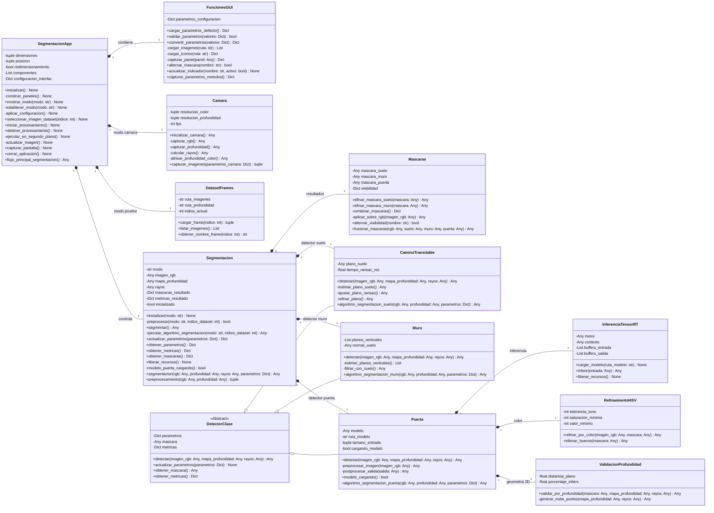

# Diagrama de clases actualizado para el flujo de segmentación

Este diagrama conserva la estructura de relaciones del modelo de clases original e integra las funciones principales descritas en el pseudocódigo del flujo principal y del procedimiento de segmentación.

Convención de visibilidad: `+` público, `-` privado y `#` protegido.

## Correspondencia con el pseudocódigo

| Función del pseudocódigo | Clase del diagrama | Función integrada | Visibilidad |
| --- | --- | --- | --- |
| `Capturar_Parametros_Metodos()` | `FuncionesGUI` | `capturar_parametros_metodos()` | Pública |
| `Capturar_Imagenes(parametros_camara)` | `Camara` | `capturar_imagenes(parametros_camara)` | Pública |
| `Preprocesamiento(RGB, Profundidad)` | `Segmentacion` | `preprocesamiento(rgb, profundidad)` | Pública |
| `Segmentacion(...)` | `Segmentacion` | `segmentacion(rgb, profundidad, rayos, parametros)` | Pública |
| `AlgoritmoSegmentacionSuelo(...)` | `CaminoTransitable` | `algoritmo_segmentacion_suelo(...)` | Pública |
| `AlgoritmoSegmentacionMuro(...)` | `Muro` | `algoritmo_segmentacion_muro(...)` | Pública |
| `AlgoritmoSegmentacionPuerta(...)` | `Puerta` | `algoritmo_segmentacion_puerta(...)` | Pública |
| `FusionarMascaras(...)` | `Mascaras` | `fusionar_mascaras(...)` | Pública |

Las funciones auxiliares que no aparecen como punto de entrada del pseudocódigo ni como contrato entre clases se modelan como privadas. Por ejemplo, `capturar_rgb`, `capturar_profundidad`, `calcular_rayos`, `alinear_profundidad_color`, `estimar_plano_suelo`, `estimar_planos_verticales`, `preprocesar_imagen`, `postprocesar_salida`, `generar_nube_puntos`, `combinar_mascaras` y `aplicar_sobre_rgb` quedan encapsuladas dentro de sus respectivas clases.

## Flujo resumido

1. `SegmentacionApp` controla la interfaz, obtiene parámetros desde `FuncionesGUI` y activa el procesamiento en segundo plano.
2. En modo cámara, `Camara` captura RGB, profundidad y rayos; en modo prueba, `DatasetFrames` carga los frames del dataset.
3. `Segmentacion` ejecuta el preprocesamiento y coordina los detectores de suelo, muro y puerta.
4. `CaminoTransitable`, `Muro` y `Puerta` implementan los algoritmos grandes de segmentación de cada clase.
5. `Puerta` usa `InferenciaTensorRT`, `RefinamientoHSV` y `ValidacionProfundidad` como módulos auxiliares.
6. `Mascaras` combina los resultados y genera la imagen final con máscaras sobre RGB.
