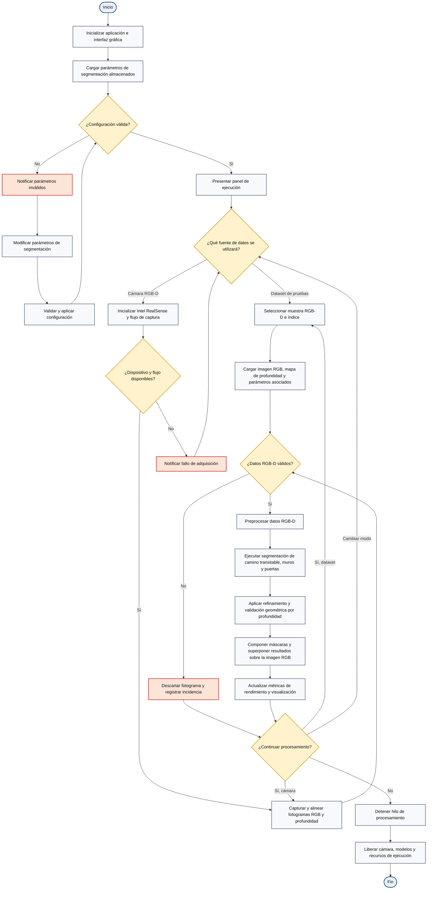

# Diagrama de flujo del funcionamiento general de la aplicación

El siguiente diagrama representa el flujo operativo de la aplicación de segmentación semántica RGB-D. Distingue el procesamiento en línea mediante una cámara Intel RealSense del procesamiento fuera de línea mediante el conjunto de datos de prueba.

## Convenciones

- Los nodos ovalados representan el inicio y el fin del proceso.
- Los rectángulos representan actividades o procesos del sistema.
- Los rombos representan decisiones con salidas explícitamente etiquetadas.
- El color rojo identifica rutas de excepción o datos no válidos.

**Título sugerido para el documento:** *Diagrama de flujo del procesamiento de segmentación semántica RGB-D en modos en línea y fuera de línea*.

**Nota metodológica:** la configuración de parámetros se presenta como una etapa validable e iterativa. La selección de la fuente se formula como una pregunta con dos entradas técnicamente diferenciadas: cámara RGB-D y conjunto de datos de prueba.
