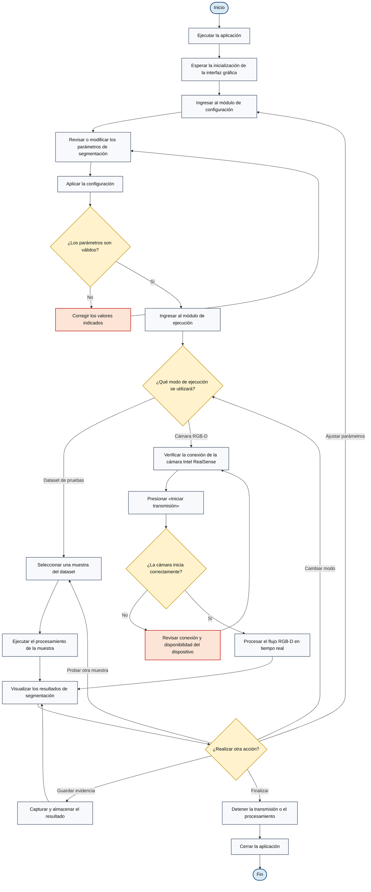

# Flujo general de operación de la aplicación

Este diagrama presenta, desde la perspectiva del usuario, la secuencia recomendada para configurar y ejecutar correctamente la aplicación.

**Título sugerido para el documento:** *Diagrama de flujo general para la operación de la aplicación de segmentación RGB-D*.

El diagrama representa las acciones visibles para el usuario. Los procesos internos de adquisición, preprocesamiento y segmentación pueden documentarse por separado en un diagrama técnico del sistema.
